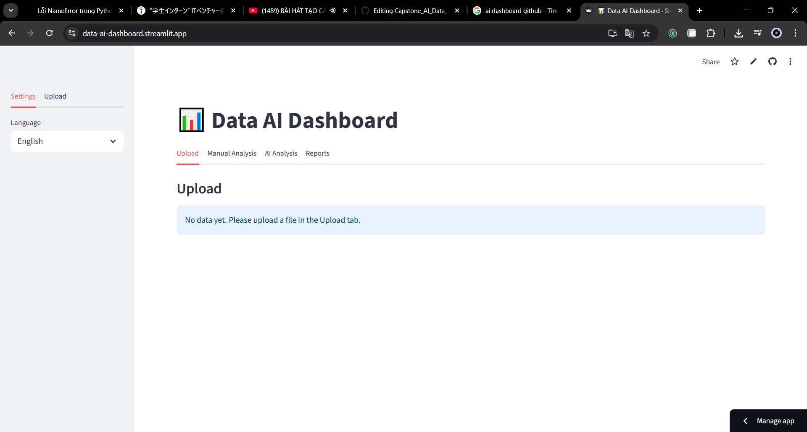

# 📊 Data AI Dashboard (Streamlit + Python)

Upload → Auto-clean → Manual/AI Analysis → Charts → Excel Export → i18n (EN/VI).  
Generate quick insights from charts via **Gemini**. Built with **Streamlit**, **pandas**, **Matplotlib**.

<p align="center">
  <!-- Optional: replace with your image -->
  
</p>

---

## ✨ Features
- Upload: **CSV / XLSX / JSON**
- **Auto Clean**: strip text, fill numeric NaN = 0, drop duplicates
- **Manual Analysis**: groupby (sum/mean/count/min/max) & charts (Line/Bar/Scatter/Pie)
- **AI Analysis (Gemini)**: short insights (EN/VI) + dataset-aware Q&A
- **Reports**: preview charts & insights, delete, **Export Excel**
  - Pivot table at **A1**
  - Chart image at **F1**
  - AI insight at **F24**
- **i18n**: English / Vietnamese via JSON locale (safe EN fallback)
- Cloud-friendly chart dir (`/tmp/charts` via secrets)
---

## 🚀 Quick Start

### 1) Clone & venv
```bash
git clone https://github.com/<yourname>/Capstone_AI_Data_Dashboard.git
cd Capstone_AI_Data_Dashboard
python -m venv .venv
# Windows
. .venv/Scripts/activate
# macOS/Linux
# source .venv/bin/activate
```

### 2) Install
```bash
pip install -r requirements.txt
```

> **requirements.txt** (gợi ý)
```txt
streamlit
pandas
numpy
matplotlib
seaborn
Pillow
python-dotenv
google-generativeai
langchain
faiss-cpu
xlsxwriter
openpyxl
```

### 3) Set API key
Tạo file `.env` (ở gốc):
```env
GEMINI_API_KEY=YOUR_GEMINI_API_KEY
```

### 4) Run
```bash
streamlit run app.py
```

---

## 🗂️ Structure
```
Capstone_AI_Data_Dashboard/
├─ app.py
├─ helpers/
│  ├─ ai_insight.py       # Gemini prompts, auto-analysis, Q&A (dataset-aware)
│  ├─ charts.py           # Plot & save charts (PNG)
│  ├─ data_processing.py  # auto_clean_data
│  ├─ excel_report.py     # Excel export (pivot @A1, chart @F1, insight @F24)
│  └─ paths.py            # get_chart_dir(): ./charts (local) or /tmp/charts (cloud)
├─ locales/
│  ├─ en.json
│  └─ vi.json
├─ charts/    # generated charts (local)
├─ exports/   # exported Excel
└─ README.md

```

---

## 🌐 i18n (EN/VI)
- `helpers/i18n.py` hợp nhất `en.json` (base) + `vi.json` (overlay) → **dict read-only**.
- Dùng `trans(locale, "key", "fallback")` trong UI để an toàn khi thiếu key.


---

## 🧠 Notes (AI)
- `.env` cần `GEMINI_API_KEY`.  
- `helpers/ai_insight.py` dùng **system_instruction** khoá ngôn ngữ (EN/VI) + lặp lại clause trong prompt để tránh trộn ngôn ngữ.

---

## 📦 Excel Export
- Gom `manual_reports + ai_reports`, prefix sheet: `MAN_...` và `AI_...`.
- Lưu tại `reports/all_reports_YYYYMMDD_HHMMSS.xlsx`.

---

## 📝 License
MIT © 2025
